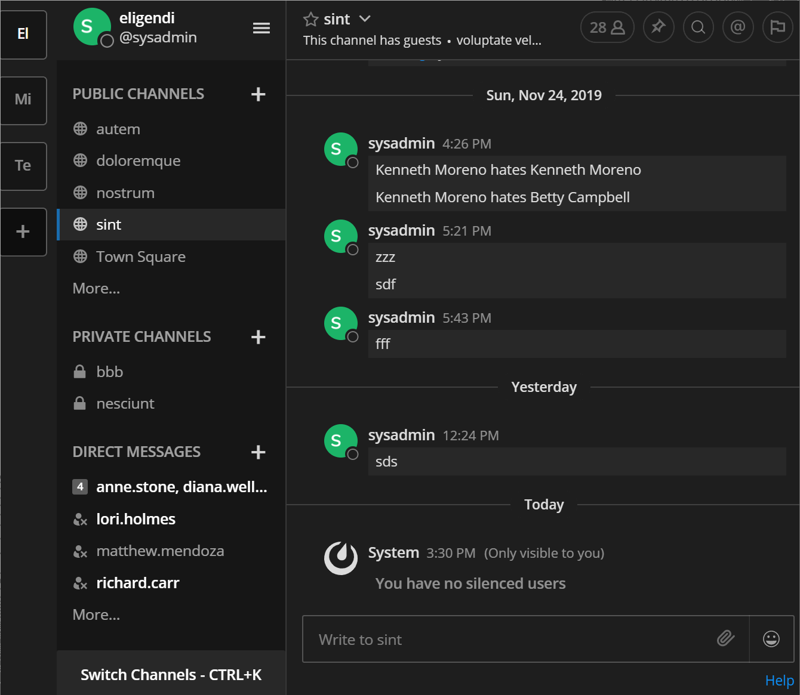

# Silencer 🔫
This plugin makes it easy silence/mute specific users without muting the whole channel.

Created as part of [Mattermost Hackathon 2019](https://github.com/mattermost/mattermost-hackathon-nov2019#how-do-i-submit-my-project)



## Install
Simply upload the plugin bundle [from the releases page](https://github.com/tjmnmk/mattermost-plugin-silencer/releases) to your Mattermost server and configure the fields on the settings page.

## Usage
User `/silencer` slash command:

```
User Silencer
/silencer - Show a list of currently silenced users.
/silencer @user - Toggle silencing user by name.
/silencer clear - Clear the list of silenced users.
/silencer help - Show this help text.
```

